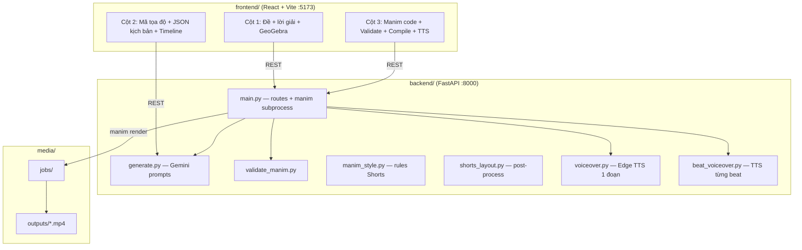

# Manim Video Studio — PROJECT GRAPH (đọc trước khi explore)

> Bản đồ hệ thống gọn cho agent/human. **Đọc file này thay vì quét toàn repo** → tiết kiệm token.

## 1. Kiến trúc



## 2. Luồng giáo viên (4 cột UI)

| Bước | Cột | Hành động | Output |
|------|-----|-----------|--------|
| 1 | 1 | Nhập đề/ảnh → AI đề+lời giải | `problemText`, `solutionSteps[]` |
| 2 | 1 | GeoGebra chỉnh hình → Lưu PNG | `savedGgbImage`, `ggbCommands` |
| 3 | 2 | Mã tọa độ → AI kịch bản | `storyboardText` (JSON `beats[]`) |
| 4 | 2 | Timeline: thứ tự beat + `narration_text` | JSON cập nhật |
| 5 | 2 | Tạo code Manim từ kịch bản | `code` (Python) |
| 6 | 3 | Validate → Preview frame → **Compile** | `jobId`, MP4 (im lặng) |
| 7 | 3 | **Ghép giọng theo timeline (beat)** hoặc lồng tiếng 1 đoạn | MP4 có tiếng |

**Windows:** `C:\Users\ADMIN\manim-video-studio` → `.\Mo-Manim-Studio.bat` → `git pull origin main`

## 3. Storyboard JSON (trung tâm dữ liệu)

```json
{
  "video_format": "shorts",
  "beats": [
    {
      "id": "beat-0",
      "phase": "problem_and_figure | transition_hide_problem | solution_steps | page_break | conclusion",
      "text_lines": ["..."],
      "latex_lines": ["\\Rightarrow ..."],
      "narration_text": "lời đọc TTS (đề / câu a / câu b)",
      "visible": true,
      "actions": ["write_line", "indicate:AB"],
      "figure_targets": ["circle", "A"]
    }
  ]
}
```

**Phases Shorts TQH:** `title → problem_and_figure → transition_hide_problem → solution_steps* → page_break → conclusion`

**Frontend timeline:** `storyboardTimeline.js` ↔ `SceneTimeline.jsx` ↔ `applyTimelineToStoryboard()`

## 4. Ba đường có tiếng

| Cách | Khi nào | File / API |
|------|---------|------------|
| A. Beat TTS (khuyến nghị) | `Scene` thường + có kịch bản | `POST /api/generate-beat-narrations` → `POST /api/voiceover/beats` |
| B. Một đoạn Edge TTS | Không chia beat | `POST /api/generate-script` → `POST /api/voiceover` |
| C. manim-voiceover | Code `VoiceoverScene` + GTTSService | Template `style_shorts_voiceover_demo.py`, render lúc compile |

## 5. Quy tắc Shorts hiện hành (code Manim)

```
config 1080×1920 | TOP_BUFF=0.05 | FIGURE_RATIO=0.58 | SAFE_W | TEXT_W
Khối chữ: arrange(LEFT) + center_block()  — KHÔNG center_x từng dòng
Hình: center_x(figure) + fit_figure_full_width()
Góc: interior_angle_at / right_angle_at (<180°)
CẤM: Tex(), align_to(LEFT_EDGE), shift(UP*2), panel.scale(0.38)
```

**Nguồn chân lý:** `backend/manim_style.py` → `SHORTS_TQH_LAYOUT_RULES`  
**Mẫu:** `style_shorts_sync_choreography.py` (vàng), `style_shorts_tqh_geometry.py`, `style_shorts_venn_sets.py`, `style_shorts_voiceover_demo.py`  
**Gem:** `docs/GEM-INSTRUCTIONS-MANIM.txt` + `docs/GEM-KNOWLEDGE-PACK.md` (upload Knowledge)

## 6. API index (main.py)

| Endpoint | Mục đích |
|----------|----------|
| `POST /api/generate-problem-solution` | Đề + bước giải |
| `POST /api/generate-geogebra` | Lệnh GeoGebra |
| `POST /api/export-figure-reference` | Mã tọa độ Manim |
| `POST /api/generate-storyboard` | JSON kịch bản |
| `POST /api/generate-manim` | Python từ storyboard |
| `POST /api/validate-manim` | Kiểm tra code |
| `POST /api/compile` | Render MP4 |
| `GET /api/jobs/{id}` | Poll trạng thái |
| `POST /api/generate-beat-narrations` | Lời đọc từng beat |
| `POST /api/voiceover/beats` | Ghép TTS timeline |
| `POST /api/voiceover` | TTS một đoạn |
| `POST /api/preview-frame` | PNG preview |
| `POST /api/fix-canvas-from-error` | Sửa GeoGebra/kịch bản từ lỗi |

## 7. File map (chỉ file quan trọng)

| File | Vai trò |
|------|---------|
| `frontend/src/App.jsx` | UI 3 cột, prompts Gemini nhúng, compile/TTS handlers |
| `frontend/src/storyboardTimeline.js` | Parse/sync beats, narration segments |
| `frontend/src/SceneTimeline.jsx` | UI timeline + ô lời đọc |
| `frontend/src/sceneLayers.js` | Layer editor từ code Manim |
| `frontend/src/figureReference.js` | GeoGebra → figure_objects |
| `backend/main.py` | FastAPI, templates, `run_manim()` |
| `backend/generate.py` | Tất cả prompt + `generate_*()` Gemini |
| `backend/manim_style.py` | Style VN, beat order, layout rules, angle rules |
| `backend/validate_manim.py` | AST validate, `uses_manim_voiceover()` |
| `backend/shorts_layout.py` | Inject helpers Shorts vào code |
| `backend/voiceover.py` | Edge TTS + merge 1 track |
| `backend/beat_voiceover.py` | TTS từng beat + timeline slots |
| `docs/GEM-INSTRUCTIONS-MANIM.txt` | Paste vào Gemini Gem Instructions |
| `docs/GEM-KNOWLEDGE-PACK.md` | Danh sách file upload Gem Knowledge |
| `backend/examples/style_shorts_sync_choreography.py` | Mẫu vàng đồng bộ chữ+hình+góc |
| `backend/examples/shorts_animation_kit_snippet.py` | Hằng số màu NTSM, RUN_*, play_sync |
| `docs/mau-prompt-buoc-*.txt` | Prompt 3 bước Gem |
| `Mo-Manim-Studio.bat` | Khởi động Windows |

## 8. Chỉ mục sửa nhanh

| Muốn sửa… | File |
|-----------|------|
| Layout Shorts / prompt Gemini code | `manim_style.py`, `App.jsx` (SHORTS_TQH_*), `GEM-INSTRUCTIONS-MANIM.txt` |
| API mới / timeout compile | `main.py` |
| Prompt AI kịch bản | `generate.py` → `STORYBOARD_PROMPT` |
| Prompt AI Manim | `generate.py` → `MANIM_FROM_STORYBOARD_PROMPT` |
| TTS từng beat | `beat_voiceover.py`, `App.jsx` handleApplyBeatVoiceover |
| Timeline UI | `SceneTimeline.jsx`, `storyboardTimeline.js` |
| Mẫu video Gem | `backend/examples/style_shorts_*.py` |
| Rule Cursor Agent viết scene | `.cursor/rules/manim-video-lessons.mdc` |

## 9. Phụ thuộc

- Python: `manim`, `manim-voiceover[gtts]`, `edge-tts`, `fastapi`, `google-genai`
- Hệ thống: `ffmpeg`, `latex` (local_latex mode)
- Node: React 18, Vite, Monaco

## 10. Nhánh git

- **`main`** — bản giáo viên dùng (`git pull origin main`)
- Feature cũ: `cursor/plan-a-timeline-preview-21cf` (đã merge vào main)

---

*Cập nhật: khi thêm API/module lớn → sửa file này trước, không để agent grep cả repo.*
